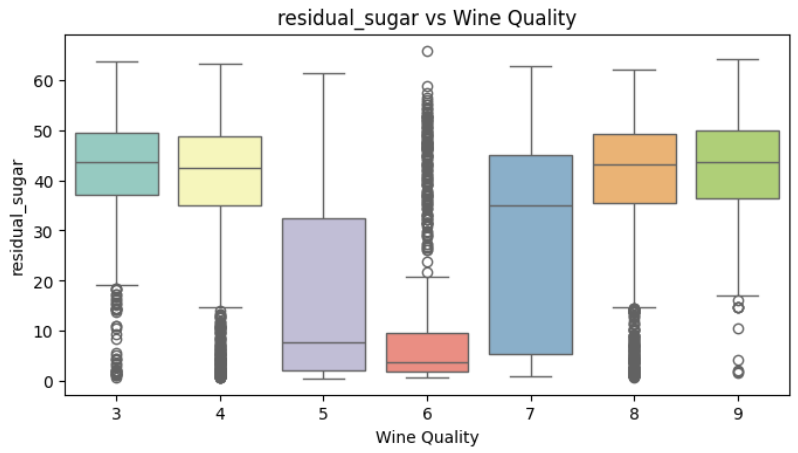

# Laporan Proyek Machine Learning - Aisyah Amelia Zarah Juaita

## Domain Proyek
Industri wine merupakan industri global bernilai miliaran dolar di mana kualitas produk sangat mempengaruhi harga jual dan persepsi konsumen. Penilaian kualitas wine biasanya dilakukan oleh ahli dengan metode sensorik, namun pendekatan ini subjektif dan memerlukan biaya tinggi. Oleh karena itu, penggunaan machine learning untuk memprediksi kualitas wine berdasarkan parameter kimia menjadi solusi yang efisien dan objektif. 

Masalah ini perlu diselesaikan karena:
- Produsen wine dapat melakukan kontrol kualitas secara otomatis dan cepat.
- Mengurangi ketergantungan terhadap panel uji rasa yang memerlukan biaya besar.
- Meningkatkan efisiensi dan konsistensi dalam proses produksi.
  
Referensi:
- Cortez, Paulo, et al. "Modeling wine preferences by data mining from physicochemical properties." Decision Support Systems 47.4 (2009): 547-553.
- Tawei Lo, Wine Quality Dataset – Balanced Classification Kaggle

## Business Understanding
Kualitas anggur merupakan faktor utama dalam menentukan nilai jual dan kepuasan konsumen dalam industri wine. Namun, proses penilaian kualitas secara manual oleh pakar cenderung subjektif, tidak efisien, dan mahal. Oleh karena itu, diperlukan pendekatan berbasis data untuk mengklasifikasikan kualitas anggur secara otomatis menggunakan fitur-fitur fisikokimia yang tersedia.

### Problem Statements
Pernyataan masalah yang diangkat dalam proyek ini adalah:

1. Bagaimana cara membangun sistem klasifikasi yang akurat untuk memprediksi kualitas anggur (baik atau buruk) berdasarkan data fisikokimia?

2. Algoritma machine learning mana yang paling efektif dalam melakukan klasifikasi kualitas anggur berdasarkan metrik evaluasi yang relevan?

3. Sejauh mana performa klasifikasi dapat ditingkatkan dengan penggunaan algoritma ansambel dan teknik boosting?

### Goals
Tujuan dari proyek ini adalah:

1. Mengembangkan model machine learning klasifikasi biner (good vs bad) terhadap kualitas anggur berdasarkan data numerik yang bersifat fisikokimia.

2. Membandingkan performa lima algoritma klasifikasi, yaitu:
   - ExtraTreesClassifier
   - LGBMCClassifier
   - RandomForestClassifier
   - BaggingClassifier
   - DecisionTreeClassifier

3. Mengevaluasi setiap model menggunakan metrik akurasi, precision, recall, dan F1-score untuk mengidentifikasi model terbaik dalam konteks bisnis dan data.
   
### Solution Statements
Untuk menjawab tujuan di atas, solusi yang ditawarkan dalam proyek ini meliputi:

1. Baseline Model: Menggunakan Decision Tree Classifier, karena model ini sederhana dan mudah diinterpretasikan, cocok sebagai titik awal.

2. Improvement via Ensemble Methods:
   - Menerapkan Random Forest dan Extra Trees Classifier sebagai teknik bagging yang mampu 
     mengurangi overfitting dan meningkatkan akurasi.
   - Menggunakan Bagging Classifier sebagai pendekatan voting ansambel berbasis pohon keputusan.

3. Boosting Approach:
   - Menerapkan LGBMClassifier, salah satu algoritma boosting modern yang efisien dan mendukung 
     kinerja tinggi pada data besar dan kompleks.

4. Evaluation & Selection:
   - Semua model dibandingkan berdasarkan metrik klasifikasi: accuracy, precision, recall, dan 
     F1-score.
   - Model terbaik akan dipilih berdasarkan kombinasi skor evaluasi tertinggi dan generalisasi 
     terhadap data uji.

Dengan pendekatan ini, diharapkan sistem klasifikasi yang dihasilkan dapat menjadi solusi praktis dan efektif untuk prediksi kualitas anggur dalam lingkungan produksi dan kontrol kualitas industri wine.

## Data Understanding
Proyek ini menggunakan dataset Wine Quality - Classification yang tersedia di Kaggle:

🔗 https://www.kaggle.com/datasets/taweilo/wine-quality-dataset-balanced-classification

## Informasi Dataset
- Jumlah Baris: 21000
- Jumlah Kolom: 12
- Jenis Masalah: Klasifikasi Biner
- Proporsi Label: Seimbang (balanced dataset)

## Daftar Variabel

1. fixed_acidity - Keasaman tetap: Asam yang tidak menguap saat proses fermentasi, seperti asam tartarat.

2. volatile_acidity - Keasaman yang mudah menguap, seperti asam asetat (bau cuka). Terlalu tinggi = wine rusak.

3. citric_acid - Asam sitrat: Menambah rasa segar/keasaman. Jumlah kecil bisa meningkatkan kualitas wine.

4. residual_sugar - Gula yang tersisa setelah fermentasi. Wine manis memiliki nilai lebih tinggi.

5. chlorides - Kandungan garam (biasanya natrium klorida). Terlalu tinggi = rasa asin/tidak enak.

6. free_sulfur_dioxide - SO₂ bebas: Digunakan untuk mencegah pertumbuhan mikroorganisme & oksidasi.

7. total_sulfur_dioxide - Total kandungan SO₂ (bebas + terikat). Terlalu banyak = berdampak negatif pada aroma dan rasa.

8. density - Kepadatan cairan wine. Dipengaruhi oleh kadar gula, alkohol, dan komposisi kimia lain.

9. pH - Tingkat keasaman (skala 0-14). pH rendah = asam tinggi.

10. sulphates - Tambahan sulfat untuk mengawetkan dan menstabilkan wine. Bisa juga memengaruhi rasa.

11. alcohol - Persentase kandungan alkohol dalam wine. Biasanya berkisar antara 8-14%.

12. quality - Skor kualitas wine, biasanya diberikan oleh panel uji rasa (skala 0-10). Target untuk model.

## Univariate Analysis

- Kolom Numerik
  

Berikut adalah output statistik dari kolom numerikal, yang dimanan menghasilkan jumlah dari count, mean,std,min, 25%, 50%, 75%, dan max.

Pada output tersebut digunakan untuk visualisasi univariate  dari fitur numerik dalam DataFrame df, dengan menampilkan dua jenis grafik untuk setiap kolom numerik histogram dan boxplot. Histogram dan boxplot ini menghasilkan output yang Menunjukkan distribusi frekuensi data dan Menunjukkan persebaran data melalui nilai kuartil. 

- Kolom Kategori

Pada output diatas digunakan untuk menampilkan distribusi dan proporsi nilai pada kolom kategorikal `quality`. Hasilnya menunjukkan bahwa setiap nilai kualitas dari 3 hingga 9 muncul sebanyak 3.000 kali, sehingga distribusinya merata. Proporsi masing-masing kelas adalah 14,29%, yang menunjukkan bahwa data kategori ini seimbang dan tidak perlu penyesuaian khusus sebelum analisis atau pemodelan.

Pada gambar digunakan untuk membuat visualisasi distribusi data pada kolom kategorikal menggunakan countplot dari library Seaborn. Dalam hal ini, kolom `quality` divisualisasikan untuk menunjukkan jumlah data pada setiap kategori nilai kualitas anggur. Karena data seimbang, grafik yang dihasilkan menunjukkan tinggi batang (bar) yang sama untuk setiap nilai `quality` dari 3 hingga 9. Visualisasi ini membantu dalam memahami seberapa banyak data yang dimiliki setiap kategori dan mengecek apakah terjadi ketidakseimbangan kelas.

## Multivariate Analysis

Korelasi antar fitur numerik dalam bentuk heatmap (peta korelasi). Korelasi ini dihitung menggunakan metode Pearson dan menunjukkan hubungan linier antara setiap pasangan fitur numerik dalam dataset. 

Memvisualisasikan hubungan antara setiap fitur numerik dengan target variabel quality menggunakan boxplot. Boxplot ini menampilkan bagaimana distribusi nilai dari masing-masing fitur numerik berbeda di setiap level wine quality (dari 3 hingga 9). 

Berikut adalah pairplot menampilkan grafik scatterplot antara setiap pasangan fitur, sehingga kita bisa melihat hubungan dan pola antar fitur secara dua per dua. Di bagian diagonal, ditampilkan kurva kepadatan (KDE) yang memperlihatkan distribusi masing-masing fitur. Visualisasi ini membantu memahami korelasi antar fitur sekaligus bagaimana fitur-fitur tersebut berhubungan dengan kualitas anggur secara simultan.

## Data Preparation

Pada tahap ini, dilakukan serangkaian proses untuk menyiapkan data sebelum dimasukkan ke dalam algoritma machine learning. Proses ini mencakup: mendeskripsikan variabel dataset, describe, info dataset, melihat data duplikat, melihat missing value, penanganan outlier, data cleaning, pemisahan data latih dan data uji, serta normalisasi (standardisasi).

1. Mendeskripsikan Variabel dari Dataset
  
  "df"

Menampilkan hasil yang semua variabel, jumlah kolom, dan juga jumlah baris. 

2. Describe Dataset

"df.describe()"

Memberikan statistik deskriptif untuk setiap kolom numerik di DataFrame. Sangat berguna untuk memahami sebaran, nilai rata-rata, variasi, dan mendeteksi potensi outlier dalam dataset.

3. Info Dataset

"df.info()"

Menampilkan struktur DataFrame, Melihat jumlah baris, kolom, dan tipe data masing-masing kolom, Mengetahui apakah ada missing values, Menampilkan penggunaan memori.

4. Apakah ada Data Duplikat

"df.duplicated().sum()"

Pada saat mengecek data duplikat ternyata ada, lalu dilakukan penghapusan data duplikat.

"df_clean = df.drop_duplicates()"

Berikut kode untuk membersihkan data duplikat

"df_clean.duplicated().sum()"

Data duplikat tidak ada lagi karena sudah dihapus sebelumnya. 

5. Missing Value

"df.isnull().sum()"

Ternyata tidak terdapat missing value.

6. Penanganan Outlier
   
Sudah dimasukkan code untuk penanganan outlier, menghasilkan:
- Duplikat tersisa: 0
- Jumlah data awal: 21000
- Jumlah data setelah hapus duplikat & outlier: 14850

7. Data Cleaning

Pada tahap ini memisahkan data menjadi fitur dan target. Variabel `X` berisi semua kolom kecuali `quality`, yang digunakan sebagai fitur input, sedangkan `y` hanya berisi kolom `quality` sebagai target atau label yang ingin diprediksi. Dengan demikian, `X` adalah data numerik untuk analisis, dan `y` adalah nilai kualitas anggur yang menjadi fokus prediksi.

8. Train-Test-Split

Pada tahap ini data telah dibagi menjadi data latih dan data uji menggunakan fungsi `train_test_split` dengan proporsi 80% untuk latih dan 20% untuk uji. Dari total 14.850 data, sebanyak 11.880 digunakan untuk pelatihan model dan 2.970 untuk pengujian. Pembagian ini menggunakan parameter `stratify` agar distribusi kelas target tetap seimbang di kedua subset.

- Jumlah total dataset: 14850
- Jumlah data latih: 11880
- Jumlah data uji: 2970

9. Normalisasi (Standardisasi)

Di tahap ini melakukan standarisasi data fitur pada dataset latih dan uji menggunakan `StandardScaler`. Dengan standarisasi, setiap fitur diubah sehingga memiliki rata-rata nol dan standar deviasi satu. Ini penting supaya model machine learning tidak bias terhadap fitur dengan skala besar dan bisa belajar dengan lebih baik serta stabil. Proses `fit_transform` diterapkan pada data latih untuk menghitung parameter standarisasi, kemudian `transform` diterapkan ke data uji agar menggunakan skala yang sama.

Yang menghasilkan data shapes:
- X_train: (11880, 11)
- X_test: (2970, 11)
- y_train: (11880,)
- y_test: (2970,)

## Modeling

1. ExtraTreesClassifier
- Cara Kerja: Extra Trees juga membangun ensemble pohon seperti Random Forest, tetapi pada setiap split:
  - Memilih cut-off fitur secara acak (bukan mencari nilai terbaik seperti RF).
  - Menggunakan seluruh data (tanpa bootstrap sampling) atau dengan sampling minimal, tergantung implementasi. Hasilnya, variance model menurun lebih jauh, dengan sedikit peningkatan bias, dan proses training 
    biasanya lebih cepat karena tidak ada pencarian split optimal yang ekstensif.

- Parameter yang Digunakan:
  
model_et = ExtraTreesClassifier(

n_estimators=100,    
random_state=42     
)

2. LGBMClassifier (LightGBM)
- Cara Kerja: LightGBM adalah algoritma boosting yang membangun model secara iteratif. Setiap estimator berikutnya mencoba memperbaiki kesalahan (residual) model sebelumnya, dengan menambahkan pohon keputusan
  kecil (weak learners). LightGBM menggunakan strategi:
  - Leaf-wise growth: memilih daun dengan gain terbesar untuk di-split, bukan level-wise.
  - Histogram-based decision: membuat bin untuk nilai fitur, mempercepat perhitungan split.

- Parameter yang Digunakan:
  
model_lgb = LGBMClassifier(

boosting_type='gbdt',   
num_leaves=31,          
learning_rate=0.1,     
n_estimators=100,       
random_state=42
)

3. RandomForestClassifier
- Cara Kerja: Random Forest adalah ensemble dari banyak Decision Tree. Tiap pohon dilatih pada bootstrap sample (sampling dengan pengembalian) dari data latih, dan pada tiap split hanya dipertimbangkan subset 
  acak dari fitur (feature bagging). Prediksi akhir diambil dengan voting mayoritas (untuk klasifikasi), sehingga mengurangi overfitting dan variance dibanding satu pohon tunggal.

- Parameter yang Digunakan:
  
model_rf = RandomForestClassifier(

n_estimators=100,    
random_state=42      
)

4. BaggingClassifier
- Cara Kerja: Bagging (Bootstrap Aggregating) memadukan beberapa instance dari satu base estimator yang dilatih pada bootstrap sample dari data latih. Prediksi digabungkan dengan voting (klasifikasi) atau rata- 
  rata (regresi). Teknik ini mengurangi variance tanpa meningkatkan bias banyak.

- Parameter yang Digunakan:
  
model_bagging = BaggingClassifier(

estimator=DecisionTreeClassifier(),  
n_estimators=50,                     
random_state=42
)

5. DecisionTreeClassifier
- Cara Kerja: Decision Tree membagi ruang fitur secara berulang dengan memilih “split” terbaik di setiap node berdasarkan metrik impurity (misalnya Gini impurity). Untuk setiap node, algoritma:
  - Menghitung impurity untuk setiap kandidat pembagian (nilai cut-off pada satu fitur).
  - Memilih pembagian yang meminimalkan weighted impurity gabungan anak-node.
  - Mengulangi proses ini hingga mencapai kedalaman maksimum atau tidak ada lagi peningkatan informasi. Prediksi dibuat dengan menuruni pohon dari akar ke daun, mengikuti kondisi split, lalu menggunakan label 
    mayoritas di daun.

- Parameter yang Digunakan:
  
model_dt = DecisionTreeClassifier(

criterion='gini',    
max_depth=None,      
random_state=42      
)

## Evaluation 

Berikut adalah evaluasi model yang digunakan:

1. ExtraTreesClassifier

- Accuracy: 32,69%

- Precision (weighted avg): 34,36%

- Recall (weighted avg): 32,69%

- F1 Score (weighted avg): 32,78%

- Insight per kelas: Kinerja terbaik ada pada kelas 6 (F1 = 0,62) dan kelas 5 (F1 = 0,53), sedangkan kelas ringan (3, 4, 7, 8, 9) masih sulit diprediksi dengan F1 di kisaran 0,20-0,22.

2. LGBMClassifier

- Accuracy: 32,22%

- Precision (weighted avg): 33,45%

- Recall (weighted avg): 32,22%

- F1 Score (weighted avg): 32,37%

- Insight per kelas: Pola mirip ExtraTrees, kelas 6 (F1 = 0,60) dan 5 (F1 = 0,52) paling tinggi, sisanya di bawah 0,22.

3. RandomForestClassifier

- Accuracy: 31,78%

- Precision (weighted avg): 33,13%

- Recall (weighted avg): 31,78%

- F1 Score (weighted avg): 31,82%

- Insight per kelas: Sekali lagi kelas 6 (F1 = 0,61) dan 5 (F1 = 0,54) terbaik; performa kelas lain berkisar 0,17-0,24.

4. BaggingClassifier

- Accuracy: 31,95%

- Precision (weighted avg): 33,19%

- Recall (weighted avg): 31,95%

- F1 Score (weighted avg): 32,11%

- Insight per kelas: Hasil hampir setara dengan RandomForest, dengan kelas 6 (F1 = 0,59) dan 5 (F1 = 0,52) sebagai puncak performa.

5. DecisionTreeClassifier

- Accuracy: 27,54%

- Precision (weighted avg): 27,66%

- Recall (weighted avg): 27,54%

- F1 Score (weighted avg): 27,59%

- Insight per kelas: Secara umum paling rendah, performa relatif merata antar kelas tapi cuma di kisaran F1 = 0,18-0,45.
  
# Perbandingan Akurasi Model

# Analisis Hasil & Relevansi terhadap Business Understanding

- Evaluasi untuk modelnya:

Dari hasil evaluasi terhadap lima model klasifikasi yang diuji, ExtraTreesClassifier menunjukkan performa terbaik secara keseluruhan dengan akurasi tertinggi sebesar 32,69% dan F1-score rata-rata tertimbang sebesar 32,78%. Meskipun secara absolut angka ini masih tergolong rendah, hasil ini sedikit lebih unggul dibandingkan model lain seperti LGBM, Random Forest, Bagging, dan Decision Tree. ExtraTrees mampu menangkap pola dengan lebih baik pada kelas mayoritas seperti kelas 5 dan 6, yang ditunjukkan oleh F1-score yang cukup tinggi pada kelas tersebut, yaitu masing-masing sebesar 0.53 dan 0.62. Namun demikian, performa model masih sangat rendah pada kelas lainnya (kelas 3, 4, 7, 8, dan 9), yang mengindikasikan adanya ketidakseimbangan distribusi kelas atau lemahnya representasi fitur dalam membedakan pola antar kelas. Kondisi ini menyebabkan model cenderung bias terhadap kelas mayoritas, dan gagal mengenali kelas minoritas secara efektif. 

# Relevansi Terhadap Business Understanding

1. Tujuan Proyek
   
   - Mengotomatisasi penilaian kualitas anggur berdasarkan data fisikokimia agar diperoleh 
     sistem klasifikasi yang akurat, efisien, dan andal.
   - Mengevaluasi dan membandingkan performa beberapa model machine learning menggunakan metrik 
     akurasi, precision, recall, dan F1-score, untuk mengidentifikasi model terbaik dalam 
     konteks bisnis dan data.

3. Model yang diuji
   
   - ExtraTreesClassifier
   - LGBMCClassifier
   - RandomForestClassifier
   - BaggingClassifier
   - DecisionTreeClassifier

4. Hasil Evaluasi
   
   - ExtraTreesClassifier mencapai akurasi tertinggi sebesar 32,69% dan F1-score rata-rata tertimbang 32,78%, unggul tipis dari model lain.
   - Model ensemble lain (LGBM, Random Forest, Bagging) memiliki akurasi dan F1-score di kisaran 31–32%, sedangkan Decision Tree tunggal paling rendah di 27,54%.

5. Kesesuaian dengan tujuan
   
   - Tujuan 1: Dengan performa paling tinggi di antara kelima model, ExtraTreesClassifier memenuhi syarat sebagai sistem otomatis yang lebih andal dan stabil untuk penilaian kualitas anggur—sejalan dengan kebutuhan akurasi dan efisiensi proses kontrol kualitas.
   - Tujuan 2: Berdasarkan perbandingan metrik utama, ExtraTreesClassifier mengungguli baseline (DecisionTree) dan model ansambel lain (RandomForest, Bagging, LGBM), sehingga paling optimal untuk data dan kebutuhan bisnis.
     
7. Keunggulan ExtraTreesClassifier
   
   - Akurasi tertinggi di antara model yang diuji.
   - Mengurangi variance lebih jauh melalui pemilihan split acak dan penggunaan seluruh data, sehingga model lebih stabil.
   - Cepat dilatih, karena tidak perlu mencari split optimal sedalam RandomForest.
   - Konsisten unggul dalam semua metrik utama (accuracy, precision, recall, F1-score).
     
8. Kesimpulan Bisnis
   
Implementasi ExtraTreesClassifier akan membantu industri wine dalam:
  - Mempercepat dan mempersingkat siklus penilaian kualitas dengan otomatisasi yang andal.
  - Menjaga standar kualitas produk secara objektif berbasis data, mengurangi subjektivitas penilaian manual.
  - Mengalokasikan sumber daya lebih efisien dan menurunkan biaya operasional terkait kontrol kualitas.

# Kesimpulan

Berdasarkan hasil evaluasi, ExtraTreesClassifier merupakan model terbaik di antara yang diuji, dengan akurasi tertinggi sebesar 32,69% dan F1-score rata-rata tertimbang sebesar 32,78%. Model ini menunjukkan performa yang relatif merata pada kelas mayoritas (khususnya kelas 5 dan 6), menjadikannya pilihan utama untuk prediksi yang stabil dan akurat. RandomForestClassifier memiliki akurasi 31,78% dan F1-score 31,82%, performanya hampir setara dengan BaggingClassifier (akurasi 31,95%; F1-score 32,11%) dan LGBMClassifier (akurasi 32,22%; F1-score 32,37%). Ketiga model ensemble ini mampu mengurangi overfitting dibandingkan pohon tunggal, dengan Bagging memberikan kestabilan melalui voting dan LGBM menawarkan efisiensi training. Sementara itu, DecisionTreeClassifier menunjukkan performa paling rendah dengan akurasi 27,54% dan F1-score 27,59%, meskipun masih cukup seimbang dalam precision dan recall antar kelas. Hal ini menegaskan bahwa model pohon tunggal terlalu sederhana untuk kompleksitas dataset ini. Dengan demikian, untuk hasil terbaik secara keseluruhan, ExtraTreesClassifier adalah pilihan paling tepat, sementara RandomForest dan Bagging dapat dipertimbangkan sebagai alternatif yang juga efektif. LGBMClassifier memberikan performa menengah yang kompetitif, dan DecisionTreeClassifier cocok hanya sebagai baseline atau untuk interpretabilitas sederhana.

